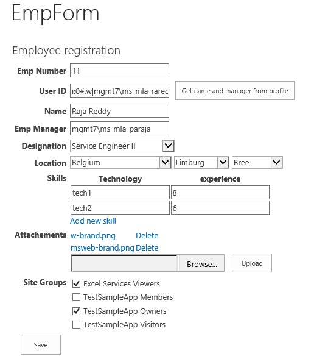
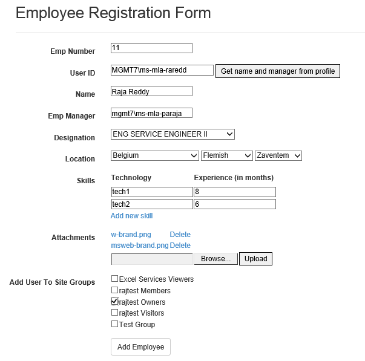
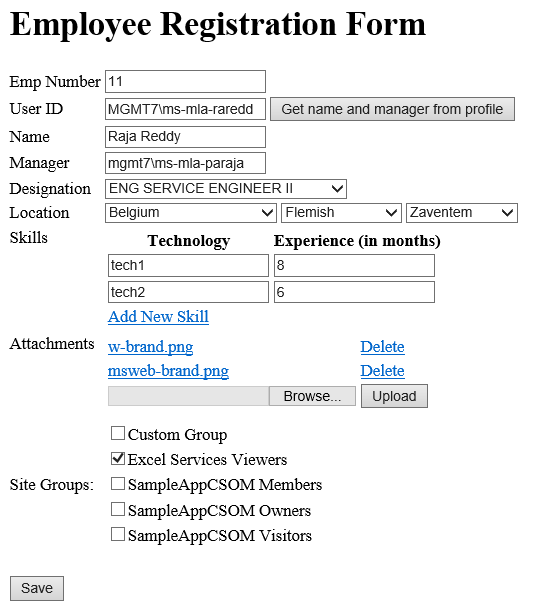

# Pattern: Populating fields on form load - read list data #
This pattern shows how to programmatically read list item data on form load.

## InfoPath approach ##
When the InfoPath is opened from InfoPath form library, it reads the xml data of form library list item and loads form in InfoPath form.

The below example shows the existing form library list item of XML data in a SharePoint form library.

```XML
<?xml version="1.0" encoding="utf-8"?>
<?mso-infoPathSolution name="urn:schemas-microsoft-com:office:infopath:EmpRegLib:-myXSD-2015-07-20T22-43-58" solutionVersion="1.0.0.481" productVersion="15.0.0.0" PIVersion="1.0.0.0" href="https://intranet.poc.com/sites/rajdev/EmpRegLib/Forms/template.xsn"?>
<?mso-application progid="InfoPath.Document" versionProgid="InfoPath.Document.4"?>
<?mso-infoPath-file-attachment-present?>
<my:EmployeeForm xmlns:xsi="http://www.w3.org/2001/XMLSchema-instance" xmlns:pc="http://schemas.microsoft.com/office/infopath/2007/PartnerControls" xmlns:ma="http://schemas.microsoft.com/office/2009/metadata/properties/metaAttributes" xmlns:d="http://schemas.microsoft.com/office/infopath/2009/WSSList/dataFields" xmlns:q="http://schemas.microsoft.com/office/infopath/2009/WSSList/queryFields" xmlns:dfs="http://schemas.microsoft.com/office/infopath/2003/dataFormSolution" xmlns:dms="http://schemas.microsoft.com/office/2009/documentManagement/types" xmlns:s="uuid:BDC6E3F0-6DA3-11d1-A2A3-00AA00C14882" xmlns:dt="uuid:C2F41010-65B3-11d1-A29F-00AA00C14882" xmlns:rs="urn:schemas-microsoft-com:rowset" xmlns:z="#RowsetSchema" xmlns:ns1="http://schemas.microsoft.com/ado/2007/08/dataservices" xmlns:m="http://schemas.microsoft.com/ado/2007/08/dataservices/metadata" xmlns:ns2="http://www.w3.org/2005/Atom" xmlns:tns="http://microsoft.com/webservices/SharePointPortalServer/UserProfileService" xmlns:s1="http://microsoft.com/wsdl/types/" xmlns:http="http://schemas.xmlsoap.org/wsdl/http/" xmlns:tm="http://microsoft.com/wsdl/mime/textMatching/" xmlns:soap="http://schemas.xmlsoap.org/wsdl/soap/" xmlns:soapenc="http://schemas.xmlsoap.org/soap/encoding/" xmlns:mime="http://schemas.xmlsoap.org/wsdl/mime/" xmlns:soap12="http://schemas.xmlsoap.org/wsdl/soap12/" xmlns:wsdl="http://schemas.xmlsoap.org/wsdl/" xmlns:ns3="http://schemas.microsoft.com/sharepoint/soap/directory/" xmlns:georss="http://www.georss.org/georss" xmlns:gml="http://www.opengis.net/gml" xmlns:my="http://schemas.microsoft.com/office/infopath/2003/myXSD/2015-07-20T22:43:58" xmlns:xd="http://schemas.microsoft.com/office/infopath/2003" xml:lang="en-US">
	<my:ddlDesignation>SERVICE ENGINEER</my:ddlDesignation>
	<my:txtName>Raja Reddy</my:txtName>
	<my:txtEmpNumber>10001</my:txtEmpNumber>
	<my:ddlCountry>2</my:ddlCountry>
	<my:ddlState>1</my:ddlState>
	<my:ddlCity>Redmond</my:ddlCity>
	<my:Skills>
		<my:Skill>
			<my:txtTechnology>SharePoint</my:txtTechnology>
			<my:txtExperience>10</my:txtExperience>
		</my:Skill>
	</my:Skills>
	<my:txtUserID>mgmt7\ms-mla-raredd</my:txtUserID>
	<my:txtManager>mgmt7\ms-mla-paraja</my:txtManager>
	<my:txtError></my:txtError>
	<my:Attachments>
		<my:EmpAttachment>
			<my:Attachment>x0lGQRQAAAABAAAAAAAAAMYBAAAKAAAATABpAG4AawBzAC4AdAB4AHQAAAANCl	Rvb2xzOg0KLS0tLS0tLS0tLS0tLS0tLS0tLQ0KaHR0cHM6Ly9zdGFja2VkaXQuaW8vZWRpdG9yIyA	NCmh0dHA6Ly93d3cubWFya2Rvd25wYWQuY29tLyANCg0KU3ludGF4Og0KLS0tLS0tLS0tLS0tLS0t	LS0tLQ0KaHR0cHM6Ly9jb25mbHVlbmNlLmF0bGFzc2lhbi5jb20vYml0YnVja2V0c2VydmVyL21hc	mtkb3duLXN5bnRheC1ndWlkZS03NzY2Mzk5OTUuaHRtbA0KaHR0cHM6Ly9oZWxwLmdpdGh1Yi5jb2	0vYXJ0aWNsZXMvbWFya2Rvd24tYmFzaWNzLyANCg0KR2l0aHViOg0KLS0tLS0tLS0tLS0tLS0tLS	0tLQ0KaHR0cHM6Ly9naXRodWIuY29tL3JhamFzaGVrYXJ1c2EvUG5QLVRyYW5zZm9ybWF0aW9uL3R	yZWUvZGV2L0luZm9QYXRoL0d1aWRhbmNlDQoNCmh0dHBzOi8vZ2l0aHViLmNvbS9PZmZpY2VEZXYv	UG5QLVRyYW5zZm9ybWF0aW9uL3RyZWUvbWFzdGVyL0luZm9QYXRoL0d1aWRhbmNl
</my:Attachment>
		</my:EmpAttachment>
	</my:Attachments>
	<my:SiteGroups>
		<my:SiteGroup>7</my:SiteGroup>
	<my:SiteGroup>7</my:SiteGroup><my:SiteGroup>21</my:SiteGroup></my:SiteGroups>
	<my:siteUrl>https://intranet.poc.com/sites/rajdev/</my:siteUrl>
	<my:prevSiteGroups>Excel Services Viewers,RajDev Visitors</my:prevSiteGroups>
</my:EmployeeForm>
```

As a result, when the form is opened again (from the form library or after downlaoding), then the saved data is loaded into the respective form controls:


## Single Page Application using Knockout.js ##
When edit item is clicked in the list, it redirects to the asp.net provider hosted app page and loads the data of list item.

The loading code is in the `loadEditFormData` JavaScript function inside the `EmpViewModel` JavaScript function:

```JavaScript
self.loadEditFormData = function () {
	var listURL = _spPageContextInfo.webAbsoluteUrl + "/_api/web/lists/getbytitle('" + employeeListname + "')/items(" + self.ID() + ")";
	$.ajax({
	    url: listURL,
	    type: "GET",
	    headers: { "accept": "application/json;odata=verbose" },
	    success: function (data) {
	        self.EmpNumber(data.d.EmpNumber);
	        self.CurrentUser(data.d.UserID);
	        self.UserID(data.d.UserID.replace('i:0#.f|membership|', ''));
	        self.Name(data.d.Title);
	        self.EmpManager(data.d.EmpManager);
	        self.Designation(data.d.Designation);
	        self.loadLocationDropDowns(data.d.Location);
	        self.loadSkills(data.d.Skills);
	        self.loadAttachments(data.d.AttachmentID);
	    },
	    error: function (error) {
	        alert(JSON.stringify(error));
	    }
	});
};  
```

As a result, App will read the list item and loads in a single app page.  
The below example shows the existing list item in a Sharepoint list.

[imgReadListItemData]: images/Common/P3_ReadListItemData.png
![][imgReadListItemData]

This data is then set into the App default page, as shown in the figure




## ASP.Net MVC approach ##
When edit item is clicked in the list, it redirects to the MVC provider hosted app page and loads the data of list item.

The submit code is in the `EmployeeController` inside method `EmployeeForm`:

```C#
string itemID = Request.QueryString["itemId"];
ListItem emplistItem = null;
if (itemID != null)
{
	List lstEmployee = web.Lists.GetByTitle("Employees");
	emplistItem = lstEmployee.GetItemById(itemID);
	clientContext.Load(emplistItem);
	emp.Id = itemID;
}
clientContext.Load(desgItems);
clientContext.Load(countryItems);
clientContext.ExecuteQuery();List<SelectListItem> empDesgList = new List<SelectListItem>();
foreach (var item in desgItems)
{
	empDesgList.Add(new SelectListItem { Text = item["Title"].ToString() });
}
emp.Designations = new SelectList(empDesgList, "Text", "Text");List<SelectListItem> cList = new List<SelectListItem>();
foreach (var item in countryItems)
{
	cList.Add(new SelectListItem { Text = item["Title"].ToString(), Value = item["ID"].ToString() });
}
emp.Countries = new SelectList(cList, "Value", "Text");
string empDesignation = string.Empty;
int stateID = 0;
int countryId = 0;

if (emplistItem != null)
{
	emp.EmpNumber = emplistItem["EmpNumber"].ToString();
	emp.Name = emplistItem["Title"].ToString();
	emp.UserID = emplistItem["UserID"].ToString();
	emp.EmpManager = emplistItem["EmpManager"].ToString();
	emp.Designation = emplistItem["Designation"].ToString();
	
	string cityVal = emplistItem["Location"].ToString();
	ViewBag.JsCity = cityVal;
	List lstCity = web.Lists.GetByTitle("EmpCity");
	CamlQuery query = new CamlQuery();
	query.ViewXml = string.Format("<View><Query><Where><Eq><FieldRef Name='Title' /><Value Type='Text'>{0}</Value></Eq></Where></Query></View>", cityVal);
	ListItemCollection cityItems = lstCity.GetItems(query);
	clientContext.Load(cityItems);
	clientContext.ExecuteQuery();
	if (cityItems.Count > 0)
	{
		stateID = (cityItems[0]["State"] as FieldLookupValue).LookupId;
	}
	ViewBag.JsStateID = stateID;
	
	List lstSate = web.Lists.GetByTitle("EmpState");
	query.ViewXml = string.Format("<View><Query><Where><Eq><FieldRef Name='ID' /><Value Type='Number'>{0}</Value></Eq></Where></Query></View>", stateID);
	ListItemCollection stateItems = lstSate.GetItems(query);
	clientContext.Load(stateItems);
	clientContext.ExecuteQuery();
	if (stateItems.Count > 0)
	{
		countryId = (stateItems[0]["Country"] as FieldLookupValue).LookupId;
	}
	emp.CountryID = countryId.ToString();
	
	string skillsData = emplistItem["Skills"].ToString();
	string[] skills = skillsData.Split(';');
	List<Skill> lsSkills = new List<Skill>();
	foreach (string skillData in skills)
	{
	    if (skillData != "")
	    {
	        string[] skill = skillData.Split(',');
			lsSkills.Add(new Skill { Technology = skill[0], Experience = skill[1] });
	    }
	}
	emp.Skills = lsSkills;
	emp.SkillsCount = lsSkills.Count;

	List<EmpAttachment> lsAttachments = new List<EmpAttachment>();
    if (attachmentItems.Count > 0)
        {
            foreach (ListItem item in attachmentItems)
        {
            lsAttachments.Add(new EmpAttachment
            {
                FileName = item["Title"].ToString(),
                FileUrl = Request.QueryString["SPHostUrl"] + "/EmpAttachments/" + item["FileLeafRef"].ToString(),
                FileRelativeUrl = item["FileRef"].ToString()
            });
        }
    }
        emp.AttachmentID = attachementID;
        emp.Attachments = lsAttachments;
        emp.AttachmentsCount = lsAttachments.Count;
	}
	else
	{
    	emp.AttachmentID = Guid.NewGuid().ToString();
	}

	emp.ActionName = "UpdateEmployeeToSPList";
	emp.SubmitButtonName = "Update Employee";
}
```

As a result, App will read the list item and it gets loaded in the MVC app page.
The below example shows the existing list item in a Sharepoint list.

![][imgReadListItemData]

This data is then set into the App default page, as shown in the figure




## ASP.Net Forms approach ##
When edit item is clicked in the list, it redirects to the asp.net provider hosted app page and loads the data of list item.

In `Default.aspx.cs` there the method `LoadListItems` that implements the save logic:

```C#
string itemID = Request.QueryString["itemId"];
if (itemID != null)
{
	List lstEmployee = web.Lists.GetByTitle("Employees");
	var emplistItem = lstEmployee.GetItemById(itemID);
	clientContext.Load(emplistItem);
	clientContext.ExecuteQuery();
	if (emplistItem != null)
	{
	    txtEmpNumber.Text = emplistItem["EmpNumber"].ToString();
	    txtName.Text = emplistItem["Title"].ToString();
	    txtUserID.Text = emplistItem["UserID"].ToString();
	    txtManager.Text = emplistItem["EmpManager"].ToString();
		ddlDesignation.SelectedValue = emplistItem["Designation"].ToString();
	    string cityVal = emplistItem["Location"].ToString();
		string stateVal = GetStateValFromCity(clientContext, web, cityVal);
		string countryVal = GetCountryValFromState(clientContext, web, stateVal);
		if (countryVal != "")
	     {
	        ddlCountry.SelectedValue = countryVal;
	        LoadStateItems();
	        ddlState.SelectedValue = stateVal;
	        LoadCityItems();
	        ddlCity.SelectedValue = cityVal;
	     }
	
	    LoadSkills(emplistItem["Skills"].ToString());
		string attachementID = ConvertObjectToString(emplistItem["AttachmentID"]);
        if (attachementID != "")
        {
            hdnAttachmentID.Value = attachementID;
            LoadAttachmentsFromSPList(attachementID, clientContext);
        }
        else
        {
            hdnAttachmentID.Value = Guid.NewGuid().ToString();
        }
	    btnUpdate.Visible = true;
	} // if (emplistItem != null)
}
```

As a result, App will read the list item and load all the data in a asp.net forms app page.
As a result, App will read the list item and it gets loaded in the MVC app page.
The below example shows the existing list item in a Sharepoint list.

![][imgReadListItemData]

This data is then set into the App default page, as shown in the figure



