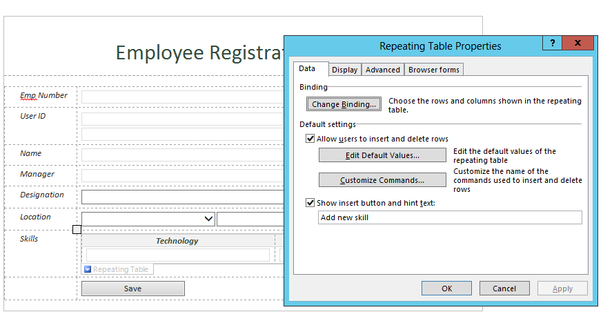
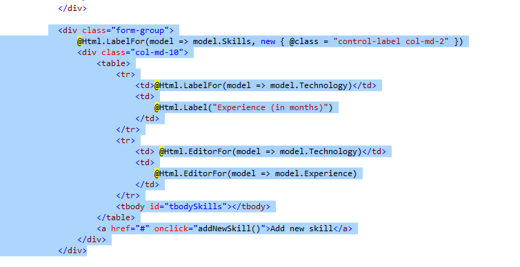
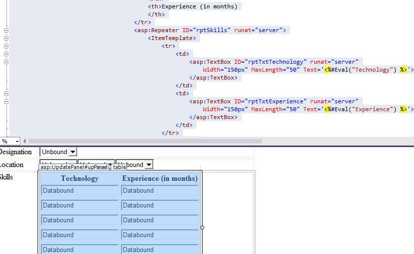

# Pattern: Read data collection and set multiple controls #
This pattern shows how to read the data from the repeatable control and submitting to List Item.

## InfoPath approach ##
As seen in the below figure, A **Repeating Table** control is used for **Skills**.  
On clicking **Add new skill**, a new row, with two rows corresponding to **Technology** and **Experience**; is added. 

  




The multiple row data is saved on the click of save button 
The below figure shows how the multiple row data is saved after result of successful submission.


## Single Page Application using Knockout.js ##
On clicking **Add New Skill**, a new row, with two rows corresponding to **Technology** and **Experience**; is added.  

The code that reads the multiple row data is in the `addSkill` JavaScript function inside the `EmpViewModel` JavaScript function:

```JavaScript  
self.addSkill = function () {
   self.Skills.push({
	  technology: "",
	  experience: ""
   });
};
```  

As a result on clicking **Add New Skill**, a new row, with two rows corresponding to **Technology** and **Experience**; is added.  


The below figure shows an example of data entered in multiple rows of the table.  


On submitting the above multiple data entries on click of **Save** button:  

The Skills to String code is in the `skillsToString` JavaScript function inside the `EmpViewModel` JavaScript function:

```JavaScript 
self.skillsToString = function () {
  var empSkills = "";
  $.each(self.Skills(), function (k, l) {
	 empSkills += l.technology + "," + l.experience + ";";
  });

  return empSkills; 
}
```

As a result the format in which multiple row data is saved after successful submission.

[formatOfMultipleDataSaved]: images/KO/P7_FormatOfMultipleDataSaved.png

![][formatOfMultipleDataSaved]


## ASP.Net MVC approach ##
On clicking **Add New Skill**, a new row, with two rows corresponding to **Technology** and **Experience**; is added. 

[addNewRow]: images/Forms/P7_AddNewRow.png

![][addNewRow]

The below figure shows an example of data entered in multiple rows of the table.

[enterDataInMultipleRows]: images/Forms/P7_EnterDataInMultipleRows.png

![][enterDataInMultipleRows]


Appending the form data code is in the `EmployeeController` inside method `AddEmployeeToSPList`:

```C#
StringBuilder sbSkills = new StringBuilder();
foreach (var skill in model.Skills)
{         
   sbSkills.Append(skill.Technology).Append(",").Append(skill.Experience).Append(";"); 
}
```

For the **view** we used  table with **tbody**,  for adding multiple rows



As a result the format in which multiple row data is saved after successful submission.

![][formatOfMultipleDataSaved]


## ASP.Net Forms approach ##
On clicking **Add New Skill**, a new row, with two rows corresponding to **Technology** and **Experience**; is added.

In `Default.aspx.cs` there the method `AddNewSkill` that implements the addition of new row Logic:

```C#
DataTable table = new DataTable();
table.Columns.Add("Technology", typeof(string));
table.Columns.Add("Experience", typeof(string));
RepeaterItemCollection skills = rptSkills.Items;
foreach (RepeaterItem skill in skills)
{
	TextBox tbTech = (TextBox)skill.FindControl("rptTxtTechnology");
	TextBox tbSkill = (TextBox)skill.FindControl("rptTxtExperience");
	table.Rows.Add(tbTech.Text, tbSkill.Text);
}
table.Rows.Add("", "");
rptSkills.DataSource = table;
rptSkills.DataBind();
```

**Repeater Control** used for adding/deleting rows with text boxes.



As a result addition of new rows consisting of two text box fields on the click of Add New Skill; and data entered in multiple rows.

![][addNewRow]
![][enterDataInMultipleRows]

On Saving this multiple row data, i.e. on click of **Save** button, the data is saved in a text format as shown below way:

In `Default.aspx.cs` there the method `LoadSkills` that implements the save logic:

```C#
string[] skills = skillsData.Split(';');
DataTable table = new DataTable();
table.Columns.Add("Technology", typeof(string));
table.Columns.Add("Experience", typeof(string));
foreach (string skillData in skills)
{
	if (skillData != "")
	{
	   string[] skill = skillData.Split(',');
	   table.Rows.Add(skill[0], skill[1]);
	}
}
rptSkills.DataSource = table;
rptSkills.DataBind();
```
As a result the format in which multiple row data is saved after successful submission.

![][formatOfMultipleDataSaved]
